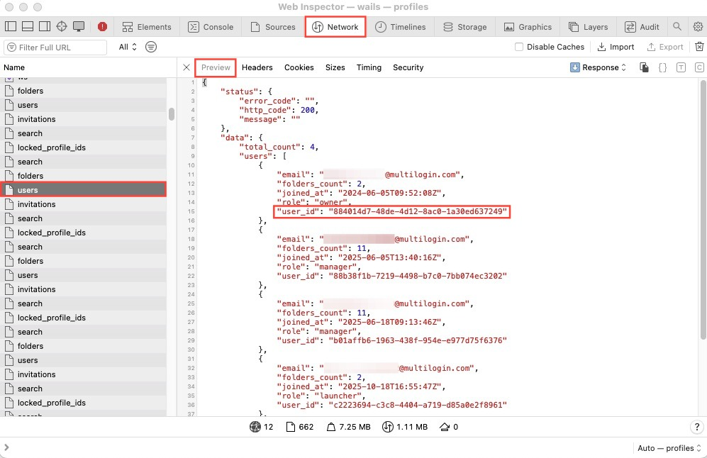
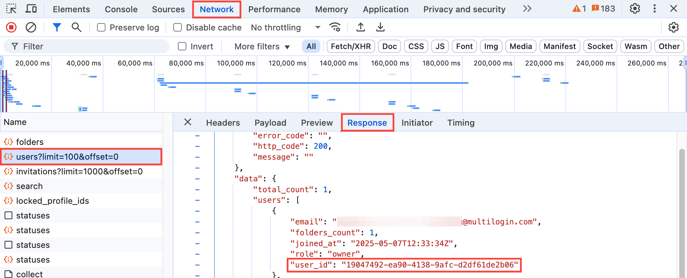

# How to Find a User ID in Multilogin Using DevTools

This guide will show you how to quickly retrieve your Multilogin user ID using your browser’s Developer Tools. This is useful for API automation, support requests, and advanced account management.

---

## Overview
- **Goal:** Retrieve your Multilogin user ID from the web app using DevTools.
- **Tools Needed:** Any modern browser (Chrome, Edge, Firefox, etc.)
- **Skill Level:** Beginner

---

## Step-by-Step Instructions

### 1. Open Multilogin and Log In
Log in to your Multilogin account at [app.multilogin.com](https://app.multilogin.com).

### 2. Open Developer Tools
- Press <kbd>F12</kbd> or <kbd>Ctrl+Shift+I</kbd> (Windows/Linux) or <kbd>Cmd+Option+I</kbd> (Mac) to open Developer Tools.
- Go to the **Network** tab.



### 3. Reload the Page
- With the Network tab open, reload the page (<kbd>F5</kbd> or <kbd>Ctrl+R</kbd>).
- This will populate the network requests list.

### 4. Filter and Locate the Users Request
- In the filter box, type `users` to find requests related to user data.
- Look for a request like `users?limit=100&offset=0`.


### 5. Inspect the Response
- Click the `users` request.
- In the right panel, select the **Response** or **Preview** tab.
- Look for the `user_id` field in the JSON response.



---

## Technical Tips
- The `user_id` is a unique identifier for your Multilogin account, used in API calls and support.
- If you have multiple users, you’ll see a list—identify your account by email or role.
- If you don’t see the request, try logging out and back in, or clear your browser cache.

---

## Example API Usage
Here’s how you might use the user ID in a Python script with the Multilogin X API:

```python
import requests

API_URL = "http://localhost:35000/api/v2/users"
API_TOKEN = "<your_api_token>"

headers = {"Authorization": f"Bearer {API_TOKEN}"}
response = requests.get(API_URL, headers=headers)

if response.ok:
    users = response.json()["data"]["users"]
    for user in users:
        print(f"User: {user['email']} | ID: {user['user_id']}")
else:
    print("Failed to fetch users.")
```

---

## Summary
You can easily retrieve your Multilogin user ID using browser DevTools. This ID is essential for API automation and support. For more automation tips, see other tutorials in this handbook.
