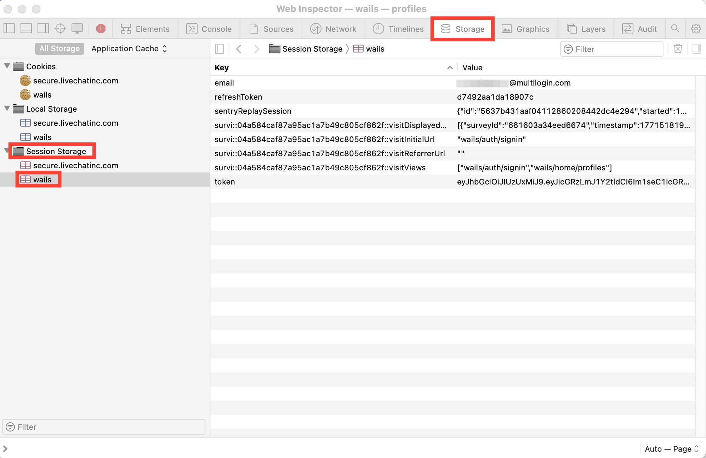

# How to Retrieve API Tokens in Multilogin Using DevTools

This tutorial explains how to quickly find your Multilogin API token using your browser’s Developer Tools. This token is required for authenticating API requests and automating tasks with Multilogin X.

---

## Overview
- **Goal:** Retrieve your Multilogin API token from the web app using DevTools.
- **Tools Needed:** Any modern browser (Chrome, Edge, Firefox, etc.)
- **Skill Level:** Beginner

---

## Step-by-Step Instructions

### 1. Open Multilogin and Log In
Log in to your Multilogin account at [app.multilogin.com](https://app.multilogin.com).

### 2. Open Developer Tools
- Press <kbd>F12</kbd> or <kbd>Ctrl+Shift+I</kbd> (Windows/Linux) or <kbd>Cmd+Option+I</kbd> (Mac) to open Developer Tools.
- Go to the **Application** (or **Storage**) tab, depending on your browser.



### 3. Locate Session Storage
- In the left sidebar, expand **Session Storage**.
- Select the entry for `https://app.multilogin.com` (or `wails` for some setups).

### 4. Find the Token
- In the key-value list, look for the key named `token`.
- The value is your API token. Copy it for use in API requests.


---

## Technical Tips
- The API token is a sensitive credential. Do not share it publicly.
- If you log out or the session expires, you may need to repeat these steps to get a new token.
- Use this token in the `Authorization` header as `Bearer <token>` for API requests.

---

## Example API Usage
Here’s how to use the token in a Python script with the Multilogin X API:

```python
import requests

API_URL = "http://localhost:35000/api/v2/profiles"
API_TOKEN = "<your_api_token>"

headers = {"Authorization": f"Bearer {API_TOKEN}"}
response = requests.get(API_URL, headers=headers)

if response.ok:
    print(response.json())
else:
    print("Failed to fetch profiles.")
```

---

## Summary
You can easily retrieve your Multilogin API token using browser DevTools. This token is required for API automation and integration. For more automation tips, see other tutorials in this handbook.
