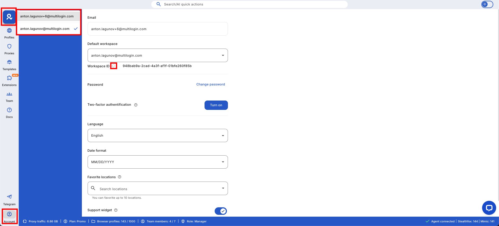
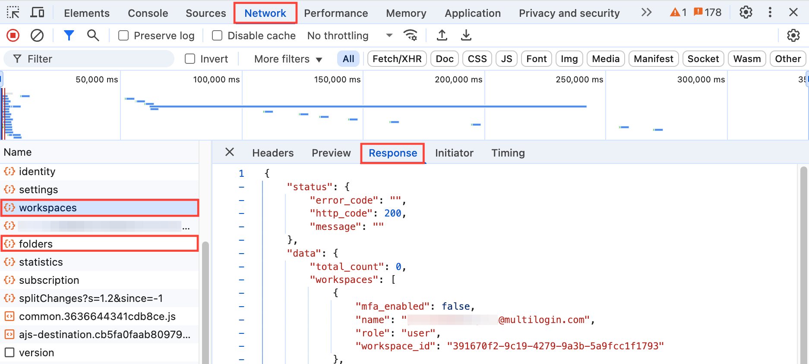
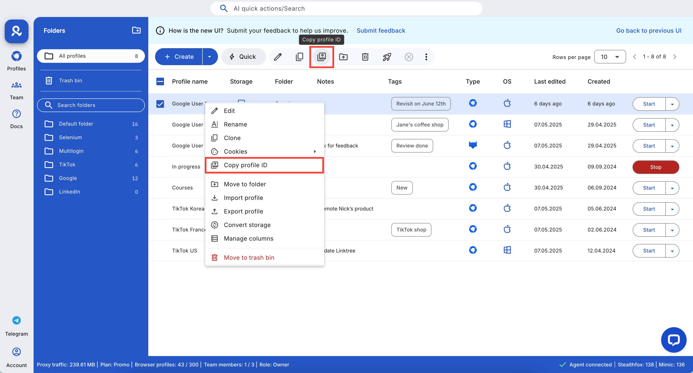

# How to Get Profile, Folder, and Workspace IDs in Multilogin Using DevTools

This tutorial shows you how to find your profile, folder, and workspace IDs in Multilogin using both the web interface and browser Developer Tools. These IDs are essential for API automation, scripting, and advanced management.

---

## Overview
- **Goal:** Retrieve profile, folder, and workspace IDs from Multilogin.
- **Tools Needed:** Any modern browser (Chrome, Edge, Firefox, etc.)
- **Skill Level:** Beginner

---

## Step-by-Step Instructions

### 1. Get Workspace ID from the Account Page
- Log in to your Multilogin account at [app.multilogin.com](https://app.multilogin.com).
- Click the **Account** icon in the sidebar.
- Your Workspace ID is displayed in the account details section.



---

### 2. Get Workspace ID Using DevTools
- Open Developer Tools (<kbd>F12</kbd> or <kbd>Ctrl+Shift+I</kbd>).
- Go to the **Network** tab and reload the page.
- Filter for `user` or `workspaces` requests.
- Click the relevant request and check the **Preview** or **Response** tab for the `workspace_id` field.




---

### 3. Get Profile and Folder IDs from the Profiles List
- Go to the **Profiles** section in Multilogin.
- Right-click a profile and select **Copy profile ID** from the context menu.
- Folder IDs can be found in the URL or by inspecting network requests related to folders.



---

## Technical Tips
- IDs are unique identifiers used in API calls and automation scripts.
- If you have multiple workspaces or folders, use the email or name to identify the correct one.
- If you don’t see the expected requests, try logging out and back in, or clear your browser cache.

---

## Example API Usage
Here’s how to use these IDs in a Python script with the Multilogin X API:

```python
import requests

API_URL = "http://localhost:35000/api/v2/profiles/<profile_id>"
API_TOKEN = "<your_api_token>"

headers = {"Authorization": f"Bearer {API_TOKEN}"}
response = requests.get(API_URL, headers=headers)

if response.ok:
    print(response.json())
else:
    print("Failed to fetch profile details.")
```

---

## Summary
You can easily retrieve profile, folder, and workspace IDs using the Multilogin interface or browser DevTools. These IDs are required for API automation and advanced management. For more automation tips, see other tutorials in this handbook.
